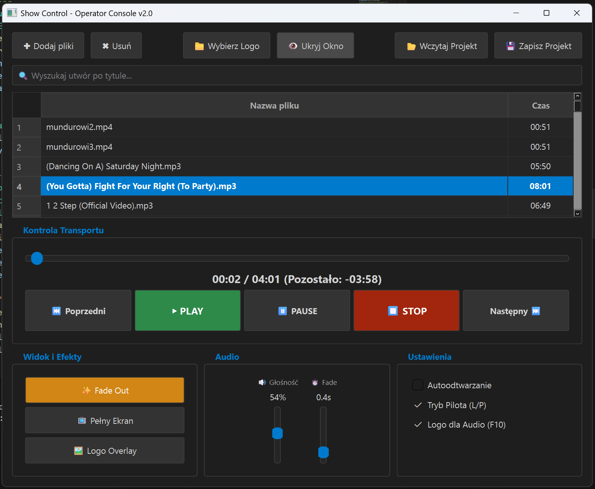

# Show Control — Operator & Projection v2.0

Profesjonalna aplikacja do zarządzania projekcją multimediów (wideo i audio) podczas wydarzeń na żywo, pokazów, prezentacji i koncertów. Program umożliwia operatorowi sterowanie listą odtwarzania na jednym ekranie (konsola operatora), podczas gdy obraz właściwy wyświetlany jest na drugim monitorze lub projektorze (okno projekcji).



---

## Funkcje i opis działania aplikacji

### 🖥️ Dwuekranowy tryb pracy
Aplikacja automatycznie wykrywa drugi monitor i otwiera na nim **okno projekcji** w trybie pełnoekranowym. Operator steruje całością z **panelu konsoli** na pierwszym ekranie. Oba okna są całkowicie niezależne, co eliminuje rozpraszanie widza interfejsem sterowania.

### 🎬 Silnik odtwarzania — LibVLC i FFmpeg
Rdzeń odtwarzania oparty na bibliotece **python-vlc** (silnik LibVLC), co zapewnia:
- Wsparcie szerokiej gamy formatów: wideo (`MP4`, `MKV`, `AVI`, `MOV` i inne) oraz audio (`MP3`, `WAV`, `FLAC`, `AAC`, `OGG`, `M4A`).
- Płynne odtwarzanie z wyjściem Direct3D11 (Windows), co minimalizuje obciążenie procesora.
- Wyjście audio przez WaveOut, bez problemu z „pukaniem" przy wyciszaniu.
- Wykorzystanie narzędzia **ffprobe** (część pakietu FFmpeg) do błyskawicznego **parsowania czasu trwania** każdego pliku w tle — bez ingerencji w główne odtwarzanie.

### 🎞️ Płynne przejścia (Crossfade)
Przełączanie między materiałami odbywa się z **efektem Fade Out / Fade In** realizowanym w osobnym wątku:
- Przed zatrzymaniem aktualnego materiału — płynne ściemnienie obrazu i ściszanie głosu.
- Bezpośrednio po uruchomieniu nowego — stopniowe rozjaśnianie obrazu i podbijanie głosu do ustawionego poziomu.
- Czas trwania efektu fade regulowany suwakiem: od **0.2 s do 2.0 s**.

### 📋 Lista odtwarzania (Playlist)
- Dodawanie plików przez dialog systemowy lub metodą **Drag & Drop** bezpośrednio na listę.
- Zmiana kolejności elementów metodą przeciągnij-i-upuść (**Drag & Drop**) wewnątrz listy — z poprawnym śledzeniem aktualnie odtwarzanego wiersza.
- Automatyczne **parsowanie czasu trwania** każdego pliku w tle (wątek z semaforem ograniczającym do 2 równoczesnych operacji).
- Podświetlanie aktualnie odtwarzanego elementu kolorem niebieskim z pogrubieniem czcionki.
- **Wyszukiwarka** z filtrowaniem listy w czasie rzeczywistym (pole tekstowe nad listą).

### 💾 Zarządzanie projektami
- Zapis listy odtwarzania do pliku **JSON** (pełne ścieżki do plików).
- Wczytanie projektu z automatyczną weryfikacją istnienia każdego pliku na dysku.
- Skrót klawiszowy **F12** do szybkiego zapisu.

### 🎚️ Kontrola transportu
| Akcja | Przycisk / Skrót |
|---|---|
| Odtwórz wybrany element | **▶ PLAY** / F4 / Enter |
| Pauza / Wznów | **⏸ PAUSE** / Spacja |
| Zatrzymaj | **⏹ STOP** / F5 |
| Poprzedni element | **⏮ Poprzedni** / F6 |
| Następny element | **Następny ⏭** / F7 |
| Fade Out i Stop | **✨ Fade Out** / F8 |

Pasek postępu umożliwia **przewijanie** materiału (przeciągnięcie suwaka) bez zakłócania animacji aktualizacji czasu — flaga `user_is_seeking` wstrzymuje odczyty pozycji podczas przeciągania.

### 🔊 Panel Audio
- **Suwak głośności** (0–100%) — zmienia głośność VLC w czasie rzeczywistym oraz mnożnik wizualizatora.
- **Suwak czasu Fade** — reguluje czas efektu wygaszania/rozjaśniania od 0.2 s do 2.0 s.
- Etykiety wyświetlają aktualne wartości obu suwaków.

### 🌊 Wizualizator Audio
Dla plików dźwiękowych (lub w trybie Logo Overlay) okno projekcji wyświetla animowany **wizualizator słupkowy**:
- 30 słupków z symulowanym widmem częstotliwości (sinusoidalne wagi środkowe + randomizacja).
- Płynna animacja wygładzania (lerp 40%) odświeżana co 50 ms.
- Wysokość słupków skalowana proporcjonalnie do bieżącego poziomu głośności.
- Opcjonalne wyświetlanie **logo** (grafika PNG/JPG) nad wizualizatorem.

### 🖼️ Widok i Efekty
| Funkcja | Opis |
|---|---|
| **Pełny Ekran** (F9) | Przełącza okno projekcji w tryb pełnoekranowy / okienkowy. |
| **Ukryj/Pokaż okno** | Chowa okno projekcji bez zamykania aplikacji (zachowanie HWND). |
| **Logo Overlay** (F11) | Zastępuje wideo wizualizatorem z logo — przydatne podczas przerw. |
| **Wybierz Logo** | Wczytuje grafikę (PNG/JPG/BMP) jako logo dla wizualizatora. |

### ⚙️ Ustawienia
- **Autoodtwarzanie** — po zakończeniu pliku automatycznie startuje kolejny.
- **Tryb Pilota (L/P)** — zmienia mapowanie nawigacji: strzałki **Lewo/Prawo** zamiast Góra/Dół, co jest standardem dla pilotów do prezentacji.
- **Logo dla Audio (F10)** — włącza/wyłącza wyświetlanie logo na wizualizatorze.

### ⌨️ Pełna lista skrótów klawiszowych
| Skrót | Akcja |
|---|---|
| **Spacja** | Play / Pauza |
| **Enter / Return** | Odtwórz zaznaczony materiał |
| **Delete** | Usuń zaznaczony element z listy |
| **F4** | Play |
| **F5** | Stop |
| **F6** | Poprzedni plik |
| **F7** | Następny plik |
| **F8** | Fade Out |
| **F9** | Pełny ekran okna projekcji |
| **F10** | Przełącz wyświetlanie logo |
| **F11** | Logo Overlay (on/off) |
| **F12** | Zapisz projekt |
| **↑ / ↓** | Nawigacja po liście (tryb standardowy) |
| **← / →** | Nawigacja po liście (tryb pilota) |

### 🛡️ Stabilność i bezpieczeństwo
- Wszystkie operacje VLC w wątkach tła — GUI nigdy nie blokuje odtwarzania.
- Semafory ograniczające liczbę równoczesnych operacji parsowania.
- Kompleksowa obsługa wyjątków (`try-except`) z cichym fail-safe — aplikacja nie crashuje.
- Zachowanie `HWND` okna projekcji przy ukrywaniu (event `closeEvent` ignoruje zamknięcie).
- Brak użycia `mute` na poziomie systemu (powoduje „pukanie" na Win32) — zamiast tego zerowanie wolumenu VLC.

---

## Instalacja i uruchomienie

### ✅ Opcja A — Gotowy plik wykonywalny `.exe` (bez instalacji Python)

Pobierz plik `ShowControl.exe` z folderu `dist/` i uruchom go bezpośrednio.

> **Wymaganie:** Zainstalowany **VLC Media Player w wersji 64-bitowej** (standardowa instalacja z [videolan.org](https://www.videolan.org/)) oraz pakiet **FFmpeg** (narzędzie `ffprobe` musi być dostępne w PATH). Aplikacja korzysta z bibliotek VLC oraz ffprobe zainstalowanych w systemie.

### 🐍 Opcja B — Uruchomienie ze źródeł (Python)

#### Wymagania
1. **Python 3.10+** (zalecany 3.11+)
2. **VLC Media Player 64-bit**
3. **FFmpeg** (z dostępnym narzędziem `ffprobe`)

#### Kroki instalacji
1. Sklonuj repozytorium lub pobierz pliki projektu.
2. Otwórz terminal w folderze projektu.
3. (Opcjonalnie) Stwórz i aktywuj środowisko wirtualne:
   ```bash
   python -m venv .venv
   # Windows:
   .venv\Scripts\activate
   ```
4. Zainstaluj wymagane biblioteki:
   ```bash
   pip install -r requirements.txt
   ```
5. Uruchom aplikację:
   ```bash
   python main.py
   ```

### 🔨 Kompilacja do .exe (opcjonalne)
Aby samodzielnie skompilować aplikację do jednego pliku wykonywalnego:
```bash
pip install pyinstaller
pyinstaller --onefile --windowed --name "ShowControl" main.py
```
Plik wynikowy znajdzie się w folderze `dist\ShowControl.exe`.

---

## Rozwiązywanie problemów

| Problem | Rozwiązanie |
|---|---|
| **Błąd biblioteki VLC** | Upewnij się, że VLC Media Player jest zainstalowany. Python 64-bit wymaga VLC 64-bit. |
| **Brak obrazu na drugim ekranie** | Sprawdź ustawienia ekranów w systemie: tryb **„Rozszerz te ekrany"**. |
| **Plik nie odtwarza się** | Sprawdź czy ścieżka do pliku nie zawiera znaków specjalnych. Upewnij się, że format jest obsługiwany przez VLC. |
| **Okno projekcji zniknęło** | Użyj przycisku **„Pokaż Okno"** na panelu operatora. |

---

## Licencja

Ten program jest wolnym oprogramowaniem na warunkach **Powszechnej Licencji Publicznej GNU (GPL) wersja 3**, wydanej przez Fundację Wolnego Oprogramowania.

Copyright © 2026 Piotr Dębowski

Szczegóły w pliku [`LICENSE`](LICENSE).
