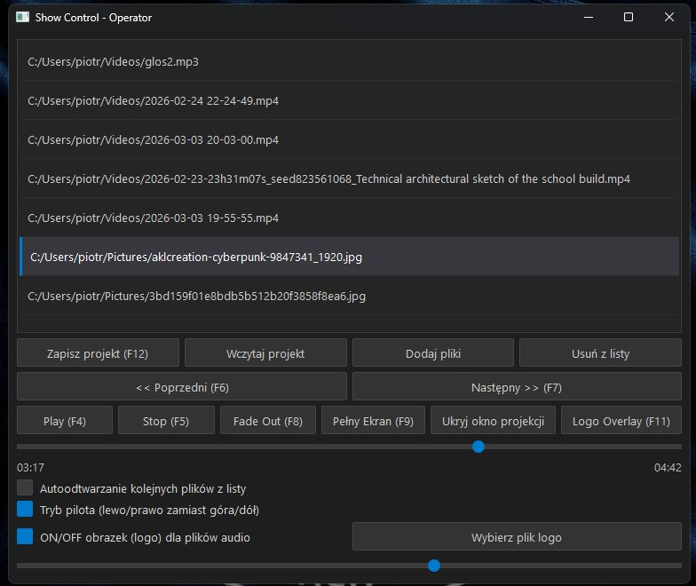

# Show Control - Operator & Projection

Aplikacja służąca do profesjonalnego zarządzania projekcją multimediów (wideo i audio) podczas wydarzeń, pokazów czy prezentacji. Program umożliwia operatorowi sterowanie listą odtwarzania na jednym ekranie, podczas gdy obraz właściwy wyświetlany jest na drugim monitorze lub projektorze.




## Funkcje główne
- **Dwuekranowość**: Osobne okno sterowania dla operatora i okno projekcji dla widzów.
- **Wsparcie formatów**: Obsługa wideo (MP4, MKV) oraz audio (MP3, WAV, FLAC itd.) dzięki silnikowi VLC.
- **Płynne przejścia**: Automatyczne efekty *Fade In* oraz *Fade Out* (płynne ściszanie i wygaszanie obrazu) przy zmianie materiałów.
- **Wizualizacje Audio**: Dynamiczny wizualizator dla plików dźwiękowych z możliwością wyświetlenia własnego logo.
- **Zarządzanie projektami**: Możliwość zapisu i wczytywania list odtwarzania do plików JSON.
- **Tryb Pilota**: Specjalny tryb umożliwiający obsługę aplikacji za pomocą standardowych pilotów do prezentacji.

## Instalacja

### Wymagania
1. **Python 3.x**
2. **VLC Media Player**: Należy zainstalować standardowy odtwarzacz VLC w wersji 64-bitowej (zgodnej z wersją Pythona), aby biblioteka `python-vlc` mogła z niego korzystać.

### Kroki instalacji
1. Sklonuj repozytorium lub pobierz pliki projektu.
2. Otwórz terminal w folderze projektu.
3. (Opcjonalnie) Stwórz i aktywuj środowisko wirtualne:
   ```bash
   python -m venv .venv
   # Windows:
   .venv\Scripts\activate
   # Linux/Mac:
   source .venv/bin/activate
   ```
4. Zainstaluj wymagane biblioteki:
   ```bash
   pip install -r requirements.txt
   ```

## Instrukcja obsługi

### Opis kontrolek (Panel Operatora)
- **Lista odtwarzania**: Główny obszar z plikami. Możesz przeciągać pliki bezpośrednio z folderu systemowego (Drag & Drop) lub zmieniać ich kolejność metodą przeciągnij i upuść.
- **Dodaj / Usuń**: Przyciski do ręcznego zarządzania listą plików.
- **Zapisz / Wczytaj projekt**: Pozwala zachować aktualny stan listy odtwarzania do późniejszego wykorzystania.
- **Play / Stop**: Rozpoczyna lub natychmiastowo zatrzymuje odtwarzanie zaznaczonego elementu.
- **Fade Out**: Płynnie wygasza aktualnie grający materiał (obraz i dźwięk) w ciągu 2 sekund, a następnie go zatrzymuje.
- **Pełny Ekran**: Przełącza okno projekcji w tryb pełnoekranowy.
- **Ukryj/Pokaż okno projekcji**: Pozwala na schowanie okna wyjściowego bez wyłączania aplikacji.
- **Logo Overlay**: Po włączeniu, zamiast wideo wyświetlana jest statyczna grafika (logo) z wizualizacją audio (przydatne podczas przerw).
- **Suwak postępu**: Pozwala na podgląd czasu trwania i szybkie przewijanie materiału.
- **Suwak głośności**: Globalna regulacja głośności odtwarzacza.
- **Autoodtwarzanie**: Jeśli zaznaczone, aplikacja po zakończeniu jednego pliku automatycznie przejdzie do następnego.
- **Tryb pilota (lewo/prawo)**: Zmienia przypisanie klawiszy strzałek. Gdy jest aktywny, nawigacja po liście odbywa się za pomocą strzałek **Lewo/Prawo** (standard dla większości pilotów do prezentacji).

### Skróty klawiszowe
- **Spacja**: Play / Pauza.
- **Enter / Return**: Uruchomienie zaznaczonego materiału (z przejściem).
- **Delete**: Usunięcie zaznaczonego elementu z listy.
- **Strzałki Góra/Dół**: Nawigacja po liście (w trybie standardowym).
- **Strzałki Lewo/Prawo**: Nawigacja po liście (w trybie pilota).

### Okno Projekcji
- Wyświetla się domyślnie na drugim monitorze (jeśli jest podłączony).
- **Podwójne kliknięcie lewym przyciskiem myszy**: Przełącza tryb pełnoekranowy.

## Rozwiązywanie problemów
- **Błąd biblioteki VLC**: Upewnij się, że masz zainstalowany odtwarzacz VLC Media Player. Jeśli używasz 64-bitowego Pythona, VLC również musi być w wersji 64-bitowej.
- **Brak obrazu na drugim ekranie**: Sprawdź ustawienia ekranów w systemie operacyjnym (tryb "Rozszerz te ekrany").
