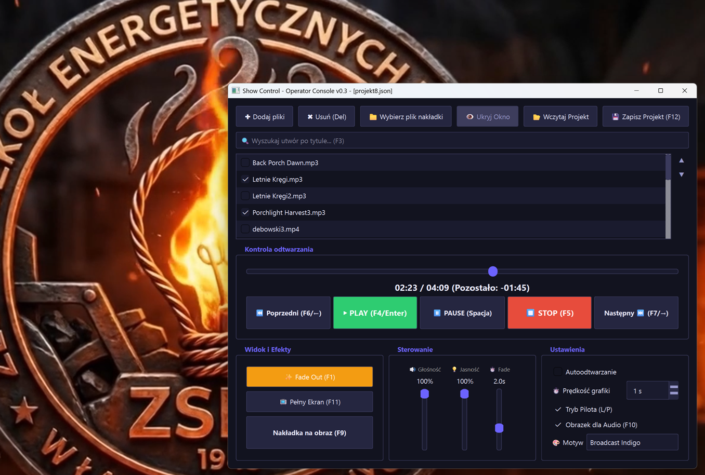

# Show Control — Operator Console v0.3

Profesjonalna aplikacja do zarządzania projekcją multimediów (wideo, audio i grafika) podczas wydarzeń na żywo, pokazów, prezentacji i koncertów. Program umożliwia operatorowi sterowanie listą odtwarzania na jednym ekranie (**konsola operatora**), podczas gdy obraz właściwy wyświetlany jest na drugim monitorze lub projektorze (**okno projekcji**).



---

## Funkcje i opis działania aplikacji

### 🖥️ Dwuekranowy tryb pracy
Aplikacja automatycznie wykrywa drugi monitor i otwiera na nim **okno projekcji** w trybie pełnoekranowym. Operator steruje całością z **panelu konsoli** na pierwszym ekranie. Oba okna są całkowicie niezależne, co eliminuje rozpraszanie widza interfejsem sterowania. Dwukrotne kliknięcie okna projekcji przełącza je między trybem pełnoekranowym a okienkowym.

### 🎬 Silnik odtwarzania — LibVLC
Rdzeń odtwarzania oparty na bibliotece **python-vlc** (silnik LibVLC), co zapewnia:
- Szerokie wsparcie formatów: wideo (`MP4`, `MKV`, `AVI`, `MOV` i inne), audio (`MP3`, `WAV`, `FLAC`, `AAC`, `OGG`, `M4A`) oraz grafika (`JPG`, `PNG`, `BMP`, `GIF`).
- Płynne odtwarzanie z wyjściem Direct3D11 (Windows), minimalizujące obciążenie procesora.
- Wyjście audio przez WaveOut, bez charakterystycznego „pukania" przy wyciszaniu.
- Dwa niezależne odtwarzacze VLC: **główny** (treść listy) i **nakładki** (logo/wideo w tle).

### 🎞️ Płynne przejścia — Fade Out
Zatrzymanie materiału realizowane jest z **efektem Fade Out** obsługiwanym przez dedykowany timer:
- Jednoczesne płynne ściemnienie obrazu (poprzez adjust brightness) i ściszenie dźwięku do zera.
- Czas trwania efektu regulowany suwakiem **Fade**: od **0.2 s do 2.0 s**.
- Po zakończeniu fade brightness okna projekcji jest automatycznie przywracana do ustawionej wartości.

### 📋 Lista odtwarzania (Playlist)
- Dodawanie plików przez dialog systemowy (przycisk **Dodaj pliki**) lub metodą **Drag & Drop** z Eksploratora Windows.
- Zmiana kolejności elementów metodą **Drag & Drop** wewnątrz listy — z poprawnym śledzeniem aktualnie odtwarzanego wiersza.
- Podświetlanie aktualnie odtwarzanego elementu (wyróżnione tło + pogrubiona czcionka).
- **Wyszukiwarka** z filtrowaniem listy w czasie rzeczywistym (skrót **F3**).
- Skrót **F2** przenosi fokus klawiatury na pierwszy element listy.
- Podwójne kliknięcie elementu uruchamia odtwarzanie.
- **☑ Checkbox nakładki per-plik** — każdy element listy posiada checkbox po lewej stronie. Zaznaczenie go sprawia, że podczas odtwarzania tego konkretnego pliku okno projekcji automatycznie przełącza się w tryb nakładki (wyświetla logo zamiast wideo). Dzięki temu przed całym pokazem można z góry skonfigurować, które materiały mają mieć aktywną nakładkę, a które mają wyświetlać wideo wprost. Stan checkboxów jest zapisywany w pliku projektu (JSON) i wczytywany przy kolejnym otwarciu.

### 🖼️ Obsługa plików graficznych (obrazy statyczne)
- Pliki `JPG`, `PNG`, `BMP`, `GIF` wyświetlane są jako pełnoekranowy obraz w oknie projekcji.
- W trybie **Autoodtwarzania** każdy obraz wyświetlany jest przez ustawiony czas (**Prędkość grafiki**: 1–60 s), po którym automatycznie przechodzi do następnej pozycji.
- Pasek postępu i etykieta czasu odliczają czas wyświetlania grafiki.

### 💾 Zarządzanie projektami
- Zapis listy odtwarzania do pliku **JSON** (pełne ścieżki do plików + ścieżka do nakładki).
- Wczytanie projektu z automatyczną weryfikacją istnienia każdego pliku na dysku — brakujące pliki są pomijane z ostrzeżeniem w konsoli.
- **Automatyczne wczytanie ostatniego projektu** przy starcie aplikacji (zapamiętywane przez QSettings).
- Aktywny projekt wyświetlany jest w tytule okna: `Show Control - Operator Console v0.3 - [nazwa.json]`.
- Skrót klawiszowy **F12** do szybkiego zapisu projektu.
- Obsługa starego formatu (lista plików) i nowego formatu (słownik z kluczem `files` i `logo`).

### 🎚️ Kontrola transportu

| Akcja | Przycisk | Skrót |
|---|---|---|
| Odtwórz zaznaczony element | **▶ PLAY** | F4 / Enter |
| Pauza / Wznów | **⏸ PAUSE** | Spacja |
| Zatrzymaj | **⏹ STOP** | F5 |
| Poprzedni element | **⏮ Poprzedni** | F6 / ↑ (lub ←) |
| Następny element | **Następny ⏭** | F7 / ↓ (lub →) |
| Fade Out i Stop | **✨ Fade Out** | F1 |

Pasek postępu umożliwia **przewijanie** materiału — flaga `user_is_seeking` wstrzymuje odczyty pozycji podczas przeciągania suwaka, zapobiegając migotaniu wskaźnika.

### 🔊 Panel Sterowania (suwaki pionowe)

Sekcja **Sterowanie** zawiera trzy niezależne suwaki pionowe:

| Suwak | Zakres | Opis |
|---|---|---|
| **🔊 Głośność** | 0–100% | Głośność wyjścia audio VLC w czasie rzeczywistym |
| **💡 Jasność** | 0–100% | Jasność i kontrast obrazu w oknie projekcji (VLC adjust) |
| **⏱ Fade** | 0.2 s–2.0 s | Czas trwania efektu wygaszania / rozjaśniania |

Suwak jasności działa jednocześnie na główny odtwarzacz wideo oraz na odtwarzacz nakładki — pozwala na delikatne przyciemnienie całej projekcji bez przerywania odtwarzania.

### 🖼️ Nakładka (Logo Overlay)

Aplikacja obsługuje **nakładkę** wyświetlaną w oknie projekcji zamiast lub na tle treści głównej:

- **Obraz statyczny** (PNG, JPG, BMP, GIF) — wyświetlany przez `LogoViewer` z zachowaniem proporcji, centrowany na czarnym tle.
- **Wideo w pętli** (MP4, MKV) — odtwarzane przez drugi odtwarzacz VLC w trybie `input-repeat=65535` (nieskończona pętla), bez dźwięku.
- Wybór pliku nakładki: przycisk **📁 Wybierz plik nakładki**.
- **Nakładka na obraz (F9)** — przełącza widok projekcji na tryb nakładki niezależnie od odtwarzanego materiału; przydatne do wyświetlania logo podczas przerw.
- **Obrazek dla Audio (F10)** — po włączeniu, podczas odtwarzania pliku audio widok projekcji automatycznie przełącza się na nakładkę (zamiast pustego czarnego okna VLC).
- Jasność nakładki zsynchronizowana ze suwakiem Jasności.

### 🎨 Motywy interfejsu

Aplikacja oferuje cztery wbudowane motywy kolorystyczne (wybór w sekcji Ustawienia):

| Motyw | Opis |
|---|---|
| **Studio Dark** | Ciemny, neutralny — klasyczne środowisko studio |
| **Studio Light** | Jasny, do pracy w dobrze oświetlonych pomieszczeniach |
| **Red Night (Stealth)** | Czerwony na czarnym — praca w ciemności bez utraty akomodacji wzroku |
| **Broadcast Indigo** | Indygo/fiolet z żywymi akcentami — domyślny w v0.3 |

Wybrany motyw zapisywany jest automatycznie przez QSettings i przywracany przy kolejnym uruchomieniu.

### ⚙️ Ustawienia

| Opcja | Skrót | Opis |
|---|---|---|
| **Autoodtwarzanie** | — | Po zakończeniu pliku automatycznie startuje kolejny element listy |
| **Prędkość grafiki** | — | Czas wyświetlania pliku graficznego (1–60 s) przy autoodtwarzaniu |
| **Tryb Pilota (L/P)** | — | Nawigacja strzałkami Lewo/Prawo zamiast Góra/Dół (standard pilotów prezentacji) |
| **Obrazek dla Audio** | F10 | Wyświetlaj nakładkę automatycznie gdy gra plik audio |
| **Motyw** | — | Wybór motywu kolorystycznego interfejsu |

### ⌨️ Pełna lista skrótów klawiszowych

| Skrót | Akcja |
|---|---|
| **F1** | Fade Out (płynne wyciszenie i ściemnienie) |
| **F2** | Fokus na pierwszy element listy |
| **F3** | Fokus na pole wyszukiwania |
| **F4 / Enter** | Play (odtwórz zaznaczony element) |
| **F5** | Stop |
| **F6** | Poprzedni plik |
| **F7** | Następny plik |
| **F9** | Nakładka na obraz (włącz/wyłącz) |
| **F10** | Obrazek dla Audio (włącz/wyłącz) |
| **F11** | Pełny ekran okna projekcji |
| **F12** | Zapisz projekt |
| **Spacja** | Play / Pauza |
| **Delete** | Usuń zaznaczony element z listy |
| **↑ / ↓** | Nawigacja po liście (tryb standardowy) |
| **← / →** | Nawigacja po liście (tryb pilota) |

### 🔁 Feedback przycisków
Każdy przycisk wyposażony jest w animację **flash** (podświetlenie na 180 ms) po naciśnięciu lub użyciu skrótu klawiszowego — zapewnia operatorowi wizualne potwierdzenie wykonanej akcji bez konieczności patrzenia na ekran.

### 🛡️ Stabilność i bezpieczeństwo
- Wszystkie operacje VLC w wątkach tła — GUI nigdy nie blokuje odtwarzania.
- Mechanizm **self-healing**: przez pierwsze 2 sekundy odtwarzania aplikacja cyklicznie synchronizuje poziom głośności z suwakiem, gwarantując poprawne ustawienie przez VLC.
- Kompleksowa obsługa wyjątków (`try-except`) z cichym fail-safe — aplikacja nie crashuje przy błędach odtwarzacza.
- Zachowanie `HWND` okna projekcji przy ukrywaniu (event `closeEvent` ignoruje zamknięcie, co chroni przed utratą uchwytu okna).
- Brak użycia `mute` na poziomie systemu (powoduje „pukanie" na Win32) — zamiast tego zerowanie wolumenu VLC.
- Obsługa starego i nowego formatu pliku projektu JSON — pełna kompatybilność wsteczna.

---

## Instalacja i uruchomienie

### ✅ Opcja A — Gotowy plik wykonywalny `.exe` (bez instalacji Python)

Pobierz plik `ShowControl.exe` z folderu `dist/` i uruchom bezpośrednio.

> **Wymaganie:** Zainstalowany **VLC Media Player w wersji 64-bitowej** (standardowa instalacja z [videolan.org](https://www.videolan.org/)). Aplikacja korzysta z bibliotek VLC zainstalowanych w systemie.

### 🐍 Opcja B — Uruchomienie ze źródeł (Python)

#### Wymagania
1. **Python 3.10+** (zalecany 3.11+)
2. **VLC Media Player 64-bit**

#### Kroki instalacji
1. Sklonuj repozytorium lub pobierz pliki projektu.
2. Otwórz terminal w folderze projektu.
3. (Opcjonalnie) Stwórz i aktywuj środowisko wirtualne:
   ```bash
   python -m venv .venv
   # Windows:
   .venv\Scripts\activate
   ```
4. Zainstaluj wymagane biblioteki:
   ```bash
   pip install -r requirements.txt
   ```
5. Uruchom aplikację:
   ```bash
   python main.py
   ```

### 🔨 Kompilacja do .exe (opcjonalne)
Aby samodzielnie skompilować aplikację do jednego pliku wykonywalnego:
```bash
pip install pyinstaller
pyinstaller --onefile --windowed --name "ShowControl" main.py
```
Plik wynikowy znajdzie się w folderze `dist\ShowControl.exe`.

---

## Rozwiązywanie problemów

| Problem | Rozwiązanie |
|---|---|
| **Błąd biblioteki VLC** | Upewnij się, że VLC Media Player jest zainstalowany. Python 64-bit wymaga VLC 64-bit. |
| **Brak obrazu na drugim ekranie** | Sprawdź ustawienia ekranów w systemie: tryb **„Rozszerz te ekrany"**. |
| **Plik nie odtwarza się** | Sprawdź czy ścieżka do pliku nie zawiera znaków specjalnych. Upewnij się, że format jest obsługiwany przez VLC. |
| **Okno projekcji zniknęło** | Użyj przycisku **„Pokaż Okno"** na panelu operatora. |
| **Brak dźwięku na starcie** | Przesuń suwak głośności — VLC może wymagać krótkiego czasu na zainicjowanie wyjścia audio. |
| **Nakładka wideo się nie zapętla** | Upewnij się, że wybrany plik wideo jest obsługiwany przez VLC i nie jest uszkodzony. |

---

## Licencja

Ten program jest wolnym oprogramowaniem na warunkach **Powszechnej Licencji Publicznej GNU (GPL) wersja 3**, wydanej przez Fundację Wolnego Oprogramowania.

Copyright © 2026 Piotr Dębowski

Szczegóły w pliku [`LICENSE`](LICENSE).
